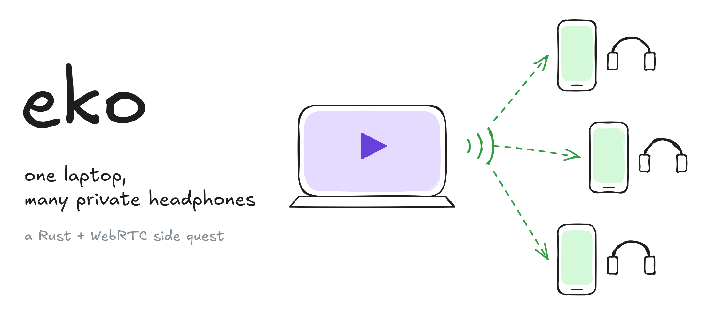
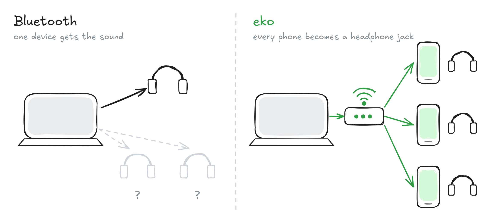
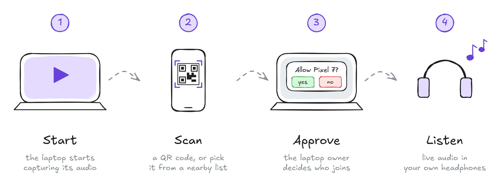
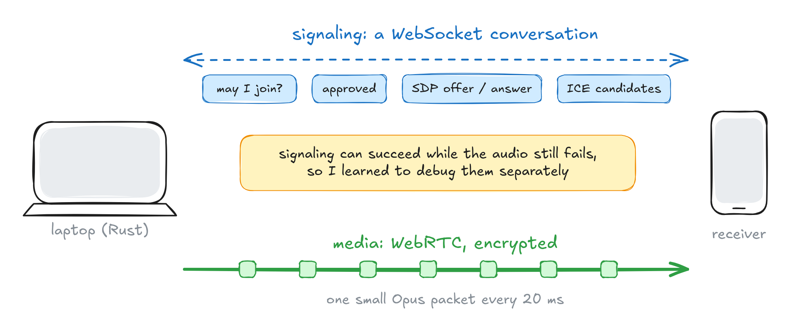
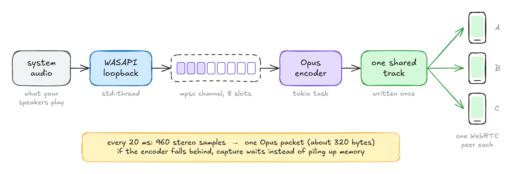
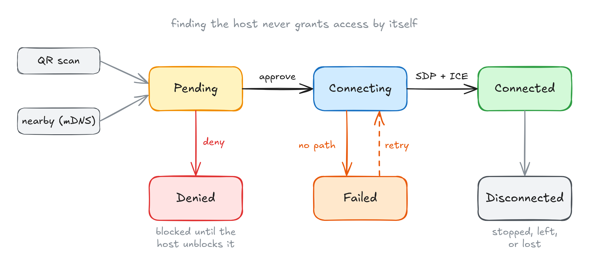
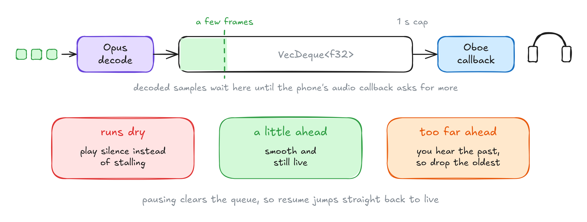
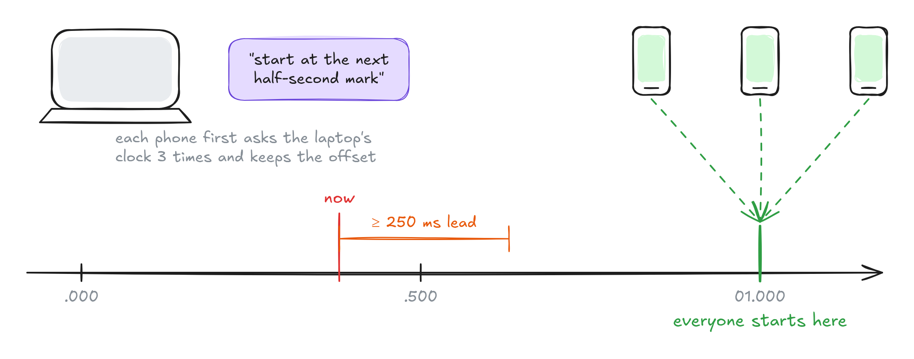
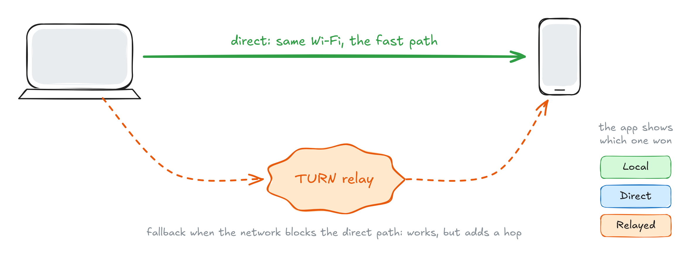

# Building eko: how I learned Rust by streaming one movie to everyone's headphones



This is the story of eko, a small app that takes whatever your laptop is playing and streams it live to your friends' phones, so everyone can listen on their own headphones. It is also the story of how I finally learned Rust, because I picked a project where the language actually mattered.

I am still early in both journeys. But I learned more from this project than from any tutorial I have followed, and I want to share how it works while it is still fresh.

## It started on a train

A few friends and I were on a long train journey and wanted to watch a movie together on one laptop. Playing it through the speakers would have annoyed everyone around us. Everyone had a phone and a pair of headphones, and yet there was no simple way to use them.

Bluetooth was the obvious first try. It is great for one pair of headphones, but it is not built to send the same stream to several independent listeners. Bluetooth LE Audio and Auracast do solve this properly, but only when every device involved supports them. None of ours did.


*Bluetooth gives the sound to one device. eko turns every phone on the network into a headphone jack.*

So the question became: **how far can I get with the devices people already carry?**

## What I wanted it to feel like

Before writing any code, I wrote down how using it should feel. No accounts. No typing IP addresses. The person with the laptop stays in control of who listens. And the audio has to feel live, because a movie where the voices arrive after the lips move is not a movie anyone wants to watch.

That turned into four steps:


*The whole experience: start the stream, scan the code, approve the phone, listen.*

Everything in the rest of this post exists to make those four steps feel that simple.

## Not reinventing the wire

My first instinct was to open a socket and start pushing audio bytes through it. I am glad I did not. Real time audio over a network needs encryption, a way for two devices to find a route to each other, a way to cope with congestion, and a codec designed for speech and music at low delay. **WebRTC** already does all of that, and it is the same technology behind video calls in the browser.

The biggest mental shift for me was realising that WebRTC is really two conversations:


*Signaling decides who connects and how. Media carries the actual sound.*

**Signaling** is a small WebSocket conversation where the phone asks to join, the laptop approves it, and both sides swap the technical details WebRTC needs: an SDP offer and answer that describe the audio, and ICE candidates that describe possible network routes.

**Media** is the audio itself, flowing as small encrypted Opus packets directly between the two devices.

This separation saved me hours later. More than once the signaling worked perfectly while no sound arrived at all. Once I understood they were two different conversations, I stopped staring at the WebSocket logs and started asking the right question: did WebRTC actually find a path for the audio?

## Why Rust

The desktop app is built with **Tauri 2**: a **React** interface on top of a **Rust** core. React handles the buttons, the QR code and the list of devices. Rust owns everything that has to keep running while you are watching: capturing audio, encoding it, signaling, discovery, WebRTC and the session itself.

I had played with Rust before, but only through small exercises, and it never really stuck. I wanted a project where performance was not an abstract idea. Real time audio is perfect for that. A new chunk of sound arrives fifty times a second, forever, and any unnecessary copy, lock or blocking call can turn into a glitch you can actually hear.

That made ownership, threads and memory feel like real tools rather than rules I had to memorise.

## Following 20 milliseconds of sound

The easiest way to explain the core of eko is to follow one small slice of audio from the laptop to a phone.


*From the speakers to every phone: capture, a small channel, one encoder, one shared track.*

On Windows, eko uses **WASAPI loopback**, which lets an app record exactly what the default speakers are playing. A dedicated thread pulls that audio in chunks of 20 ms: 960 samples for each of the two stereo channels at 48 kHz.

```rust
pub const SAMPLE_RATE: u32 = 48_000;
pub const CHANNELS: usize = 2;
pub const FRAME_MS: u64 = 20;
pub const FRAMES_PER_PACKET: usize = 960;
```

Each chunk is sent through a **bounded channel with room for 8 frames** to an async task that encodes it with **Opus** at 128 kbps. This is where Rust started teaching me things I did not expect to learn.

**A bounded channel is a design decision, not a detail.** If the encoder ever falls behind, the capture thread simply waits for space instead of quietly filling memory with audio that is already too old to be useful. The channel also handles shutdown for free. When the stream stops and the receiving end is dropped, the next send fails and the capture thread exits on its own. I did not write any special "please stop now" logic. Ownership did it for me.

**Encode once, send many.** My first mental model was one encoder per phone. The actual design writes each Opus packet exactly once into a single shared track, and every phone's WebRTC connection reads from it. Adding a fifth listener does not add a fifth encoder. Each phone still gets its own independent connection, so one person with a bad signal does not drag everyone else down.

**Real hardware is messy.** People plug in headphones in the middle of a movie, and Windows changes the default output device. eko listens for that change through a Windows notification callback, which flips an atomic flag. The capture loop notices, reconnects to the new device, and retries with a growing delay if something goes wrong. Writing that callback meant meeting `unsafe`, COM and `Arc<Mutex<...>>` all at once, and I understood each of them far better afterwards.

One rule I held myself to: **no `unwrap()` in runtime code.** Every failure becomes a `Result` with a readable message that ends up in the log or the interface. It felt slow at first. Then I noticed that when something broke, the app told me what it was instead of just disappearing.

## Letting someone in

Finding the laptop is easy. A phone can scan the QR code or find it on the local network through mDNS. But I wanted one rule to be impossible to break:

> **Pairing identifies a device. Approval authorises it.**


*Every receiver moves through the same states, whichever way it found the laptop.*

Every receiver starts as **Pending** until the person at the laptop approves it. Only then does WebRTC negotiation begin. A denied device stays blocked until the host unblocks it, so nobody can keep spamming join requests. Connections that fail can retry, and a stopped stream cleans every device up.

Rust enums made this surprisingly pleasant. Each state is a variant, the compiler forces me to handle all of them, and with `specta` the same types are generated for the TypeScript interface. The React side literally cannot invent a state the Rust side does not know about.

## The phone side

Android is the main receiver, and I wanted its audio path to be native rather than relying on a browser. The fun part: the phone runs **the same Rust core**. The React interface handles scanning, status and controls, while Rust receives the WebRTC audio, decodes the Opus packets and hands the sound to **Oboe**, Android's low latency audio library.

Between decoding and playback sits a queue, and this is where latency stopped being an abstract number for me.


*The playback queue is a balancing act between smooth and live.*

Oboe calls eko whenever the speaker needs more samples, and eko pulls them from the front of the queue. If the queue runs dry, it plays silence instead of stalling. If it grows too long, you are listening to the past, so it is capped at one second and the oldest samples are dropped first.

Pausing taught me a small but satisfying lesson. If you only silence the speaker and keep the queue, pressing play gives you a few seconds of the past. So pausing clears the queue, and resume jumps straight back to the live stream.

## Making everyone hear it at the same time

Once several phones could connect, a new problem showed up. Without coordination, each receiver starts playing whenever its own connection finishes, so the same explosion in the movie lands at slightly different moments in different headphones.


*Every phone agrees on the laptop's clock, then starts on the same half second mark.*

The fix borrows a trick from network time protocols. Each browser receiver asks the laptop for the time three times, measures the round trip, and works out how far its own clock is from the laptop's. The laptop then announces a start time: the next half second mark that is at least 250 ms away. Every phone waits for that moment on the shared clock and starts together.

It is a small feature, but it was the moment the project started to feel like something real rather than a demo. Bringing the same scheduling to the native Android player is next on my list.

## When the network says no

On a normal home Wi-Fi network, WebRTC connects the laptop and the phone directly. Some networks block that, especially public or company ones. For those cases there is a browser receiver (mainly for iPhones) which can fall back to a **TURN relay**, a server that forwards the encrypted audio when a direct path is impossible.


*Direct when possible, relayed only when necessary, and the app tells you which one you got.*

TURN works almost everywhere, but it adds a hop, latency and bandwidth, so it is a fallback and never the default. The browser receives credentials that expire after an hour instead of a permanent secret. And because "it connected" does not tell you much, eko reads the WebRTC stats for the route it actually chose and shows it next to each device: **Local**, **Direct** or **Relayed**. That single label has saved me a lot of guessing.

## What I am taking away

eko started as a small annoyance on a train. It ended up teaching me how audio moves from a sound card to a network packet and back into someone's ears, and why every buffer along the way is a trade between smoothness and delay.

It also taught me Rust the way I had always hoped to learn it. Not by memorising rules, but by running into real problems: threads that need to stop cleanly, data shared between an audio callback and a decoder, devices that disappear halfway through a movie. Every time the compiler pushed back, it was usually pointing at a bug I would otherwise have met at 2 AM.

## What comes next

So far I have built for correctness. The next step is to measure honestly on real devices: setup time, end to end latency, jitter, packet loss and how many listeners the laptop can handle before things degrade. My target is under 100 ms from speaker to headphones, and I want to publish the numbers along with the hardware and network they came from, rather than a single flattering figure.

After that: better recovery when connections drop, more work on Android background behaviour, and audio capture beyond Windows.

If you have ever wanted to watch something together without disturbing the people around you, I would love for you to try it, break it and tell me what happened.

**Source code:** [github.com/Noelithub77/eko](https://github.com/Noelithub77/eko)

**Privacy policy:** [Privacy_Policy.md](https://github.com/Noelithub77/eko/blob/main/docs/Privacy_Policy.md)
