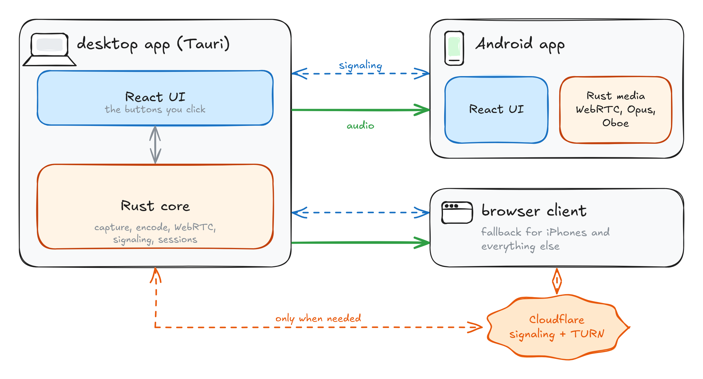
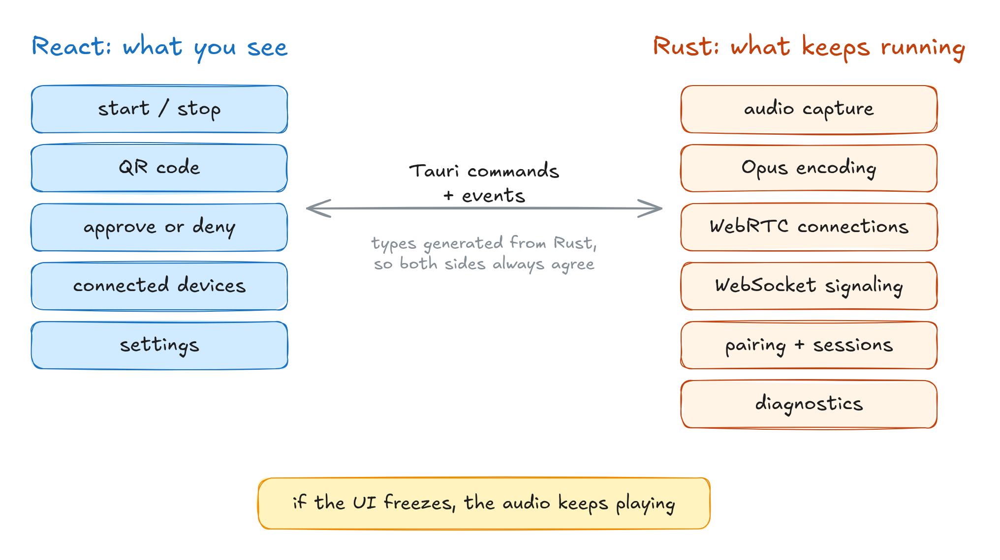
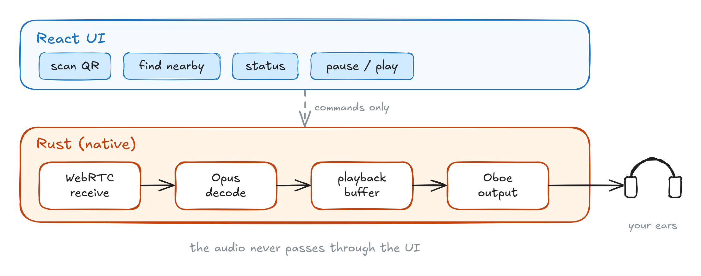

# One Laptop, Every Pair of Headphones, Zero Bluetooth

*How a train ride turned into eko, a small app that streams your laptop's audio to everyone's phone*

## 1. Why eko?

The idea for eko started on a train journey with my friends. We wanted to watch a movie together, but playing it out loud would have annoyed everyone around us. We all had phones and headphones, so it felt like this should be easy.

It wasn't. Bluetooth is great with one pair of headphones, but sending the same audio to several of them needs Bluetooth LE Audio or Auracast, and none of our devices supported either.

*Bluetooth gives the sound to one device. eko gives it to every phone.*

So I wondered how far I could get with the devices people already carry. No accounts, no typing IP addresses, and the person with the laptop decides who gets in.

*Start, scan, approve, listen. That's the whole thing.*

## 2. Exploring the Approach

I didn't want to invent my own streaming protocol, so eko uses **WebRTC**, the same thing behind video calls in your browser. It already handles encryption, finding a route between devices, congestion and low latency audio with the **Opus** codec.

What took me a while to understand is that WebRTC is really two conversations. A WebSocket where the devices agree on who is joining and how to reach each other, and then the audio itself. The first one working tells you nothing about the second. I learned that the hard way, more than once.

*Signaling sets things up. Media carries the sound.*

## 3. Architecture

eko has three parts: a desktop app that captures and sends the audio, an Android app that plays it, and a browser page as a fallback for iPhones. On a local network everything talks directly. Cloudflare only steps in for the browser when a direct connection isn't possible.

*The whole system on one page.*

### Why Rust?

Learning Rust properly was a side goal of mine. I had only tried it through small exercises, and live audio felt like the right place to learn it for real, because every wasted copy or blocking call turns into a glitch you can actually hear.

### Desktop

The desktop app uses **Tauri 2**. React draws the screens, and Rust owns everything that has to keep running while the movie plays.

*The UI only asks. Rust does the work.*

### Audio Pipeline

On Windows, eko records whatever the speakers are playing with **WASAPI loopback**, cuts it into 20 ms chunks and encodes each one as **48 kHz stereo Opus**. Each packet is encoded once and shared by every phone, so the fifth listener doesn't cost a fifth encoder.

*From the speakers to every phone.*

This is where latency stopped being an abstract number for me. Smaller packets mean less waiting but more overhead. Bigger buffers survive bad Wi-Fi but add delay. The whole game is finding the smallest numbers that still sound smooth.

### Pairing and Session Control

A phone can find the laptop through a QR code or on the local network, but finding it doesn't let it in. Pairing identifies a device. Approval authorizes it.

*Nobody gets in without the host's nod.*

### Android Receiver

On Android I wanted the audio to skip the browser completely. React handles scanning, status and buttons, while native Rust receives the stream, decodes it and plays it through **Oboe**.

*The audio never touches the UI.*

A nice side effect: pausing clears the buffer, so pressing play takes you back to live instead of replaying the last few seconds.

### Browser Fallback and TURN

Some networks, like public or office Wi-Fi, block direct connections. For those, the browser client can fall back to a **TURN relay**. It works almost anywhere, but it adds a hop and costs bandwidth, so it's the backup and never the plan. The app shows which path each device actually ended up on.

*Direct when possible, relayed only when needed.*

## 4. What I Want to Explore Next

So far everything has been about making it work. Next I want to measure it properly on real phones: setup time, end to end latency, jitter, packet loss, and how many listeners one laptop can handle before it struggles. I'd rather share honest numbers along with the hardware and network they came from than one nice looking figure.

After that: better recovery when things drop, Android background behaviour, and audio capture beyond Windows.

## What Building eko Has Taught Me

eko started from a small annoyance on a train. It ended up teaching me how sound travels from a sound card to a Wi-Fi packet and back into someone's ears, and why every buffer along the way is a trade-off. And I finally got comfortable with Rust, which was a nice bonus.

If you've ever wanted to watch something together without bothering the people around you, give it a try and tell me what breaks.

**Source code:** [github.com/Noelithub77/eko](https://github.com/Noelithub77/eko)

**Privacy policy:** [Privacy_Policy.md](https://github.com/Noelithub77/eko/blob/main/docs/Privacy_Policy.md)
